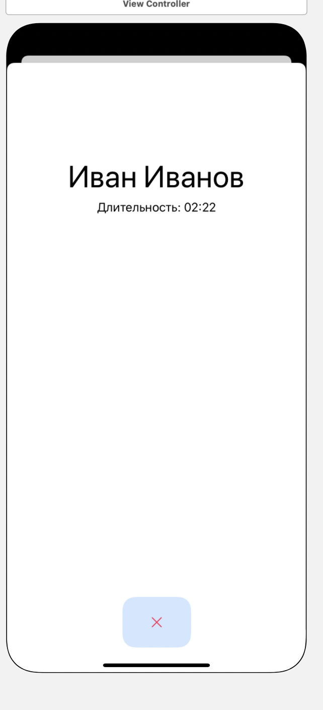

#### Представление, описывающее аудио звонок пользователя

> Связи с другими представлениями:
* Дочерний элемент представлений [Логи звонков](main.md), [Профиль пользователя](../profile/main.md)
* По нажатию кнопки завершения звонка - переход в представление [логи звонков](main.md)

> Задачи на этом представление:
* Переход в комнату аудиозвонка
* Ретроспективный дизайн представления

> Содержимое:
* Label1    - Наименование пользователя
* Label2    - Строка с длительностью аудиозвонка
* Button    - Кнопка завершения звонка

> Внешний вид:  

