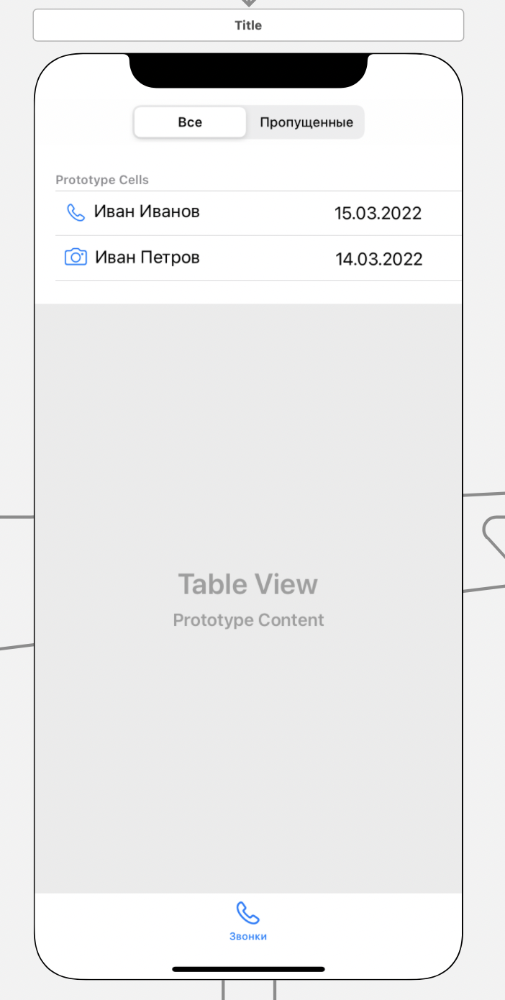

#### Представление, описывающее звонки пользователя

> Связи с другими представлениями:
* По нажатию по ячейке с логом звонка - происходит переход в [аудиозвонок](audio.md), [видео звонок](video.md)

> Задачи на этом представление:
* Ретроспективный дизайн представления
* По API доступу получаем логи выполненных звонков пользователя

> Содержимое:
* Icon      - Тип звонка (иконка "phone" - аудиозвонок; "camera" - видео звонок)
* SplitView - Переключатель между пропущенными и всеми звонками пользователя
* Label1    - Имя пользователя
* Label2    - Дата звонка

> Внешний вид:  

