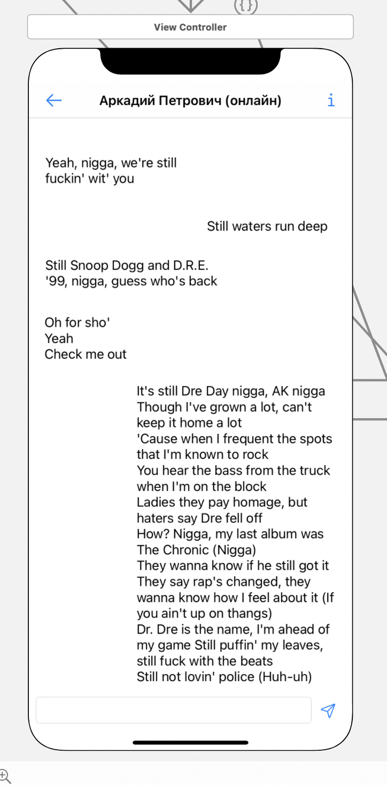

#### Просмотр истории переписки с пользователем

> Связи с другими представлениями:
* Является дочерним представлением [Чаты](/main.md) - кнопка с иконкой "<-" в левом верхнем углу
* По нажатию кнопки "i" в правом верхнем углу шапки представления - происходит переход в [профиль пользователя](../profile/main.md)

> Задачи на этом представление:
* Ретроспективный дизайн представления
* По API доступу получаем историю переписки пользователя

> Содержимое:
* TextBox - поле для ввода сообщения
* После нажатия кнопки отправить - пользователю уходит созданное сообщение

> Внешний вид:  

