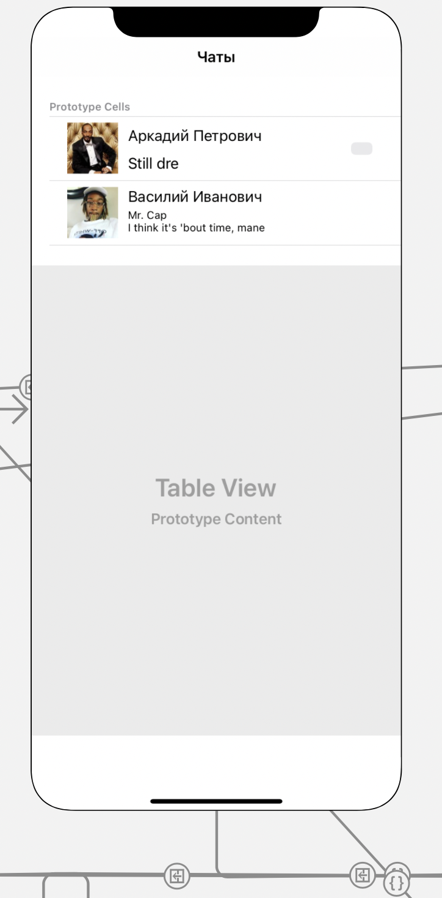

#### Представление, описывающее чаты пользователя

> Связи с другими представлениями:
* По нажатию по ячейке с последним сообщением и именем пользователя - происходит переход в [историю чата](chat_view.md)

> Задачи на этом представление:
* Ретроспективный дизайн представления
* По API доступу получаем историю переписки пользователя

> Содержимое:
* TableCell - шаблон карты с чатом
* Label1 - Имя пользователя
* Label2 - Последнее сообщение пользователя

> Внешний вид:  

