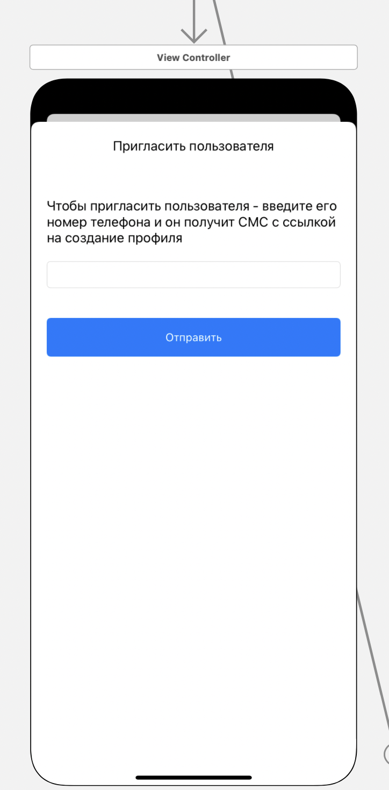

#### Приглашение абонента стать пользователем приложения

> Связи с другими представлениями:
* Является дочерним представлением [Контакты](/main.md) - кнопка с иконкой "+" в левом верхнем углу

> Задачи на этом представление:
* Ретроспективный дизайн представления
* При переходе на главный экран представления - получаем список контактов, 
добавленных пользователем с сервера посредством запроса API

> Содержимое:
* TextBox - поле для ввода номера телефона абонента,
при корректном указании телефона абонента (проверяется маской регулярного выражения)
* После нажатия кнопки отправить - абоненту уходит СМС с кодом доступа для мессенджера и ссылкой на его мобильную версию

> Внешний вид:  

