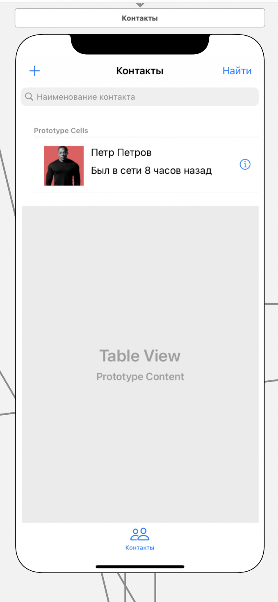

#### Реестр контактов

> Связи с другими представлениями:
* По нажатию на кнопку "+" в левом верхнем углу происходит переход на представление по [приглашению абонента](invite.md)
* По нажатию на кнопку "Найти" в правом верхнем углу происходит переход на представление по [Поиск пользователя в системе](search.md)

> Задачи на этом представление:
* Ретроспективный дизайн представления
* При переходе на главный экран представления - получаем список контактов, 
добавленных пользователем с сервера посредством запроса API

> Содержимое:
* TextBox - поле для ввода имени пользователя, 
при изменнении содержимого в этом поле - происходит обновление списка контактов ниже
* Карта профиля пользователя - минимальная информация о 
найденном пользователе и кнопка для перехода в [профиль пользоателя](../profile/main.md)

> Внешний вид:  

