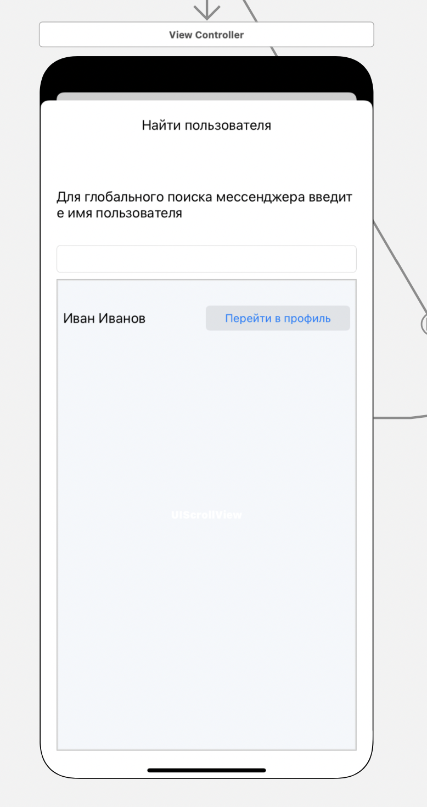

#### Поиск пользователя в системе

> Связи с другими представлениями:
* Является дочерним представлением [Контакты](/main.md) - кнопка с иконкой "Найти" в правом верхнем углу

> Задачи на этом представление:
* Ретроспективный дизайн представления
* Создание сервиса API доступа на Django Rest Framework для поиска в реестре пользователей

> Содержимое:
* TextBox - поле для ввода имени пользователя, 
каждый раз при изменении выполняется запрос к сервису API для писка пользователя в БД
* Карта профиля пользователя - минимальная информация о 
найденном пользователе и кнопка для перехода в [профиль пользоателя](../profile/main.md)

> Внешний вид:  

