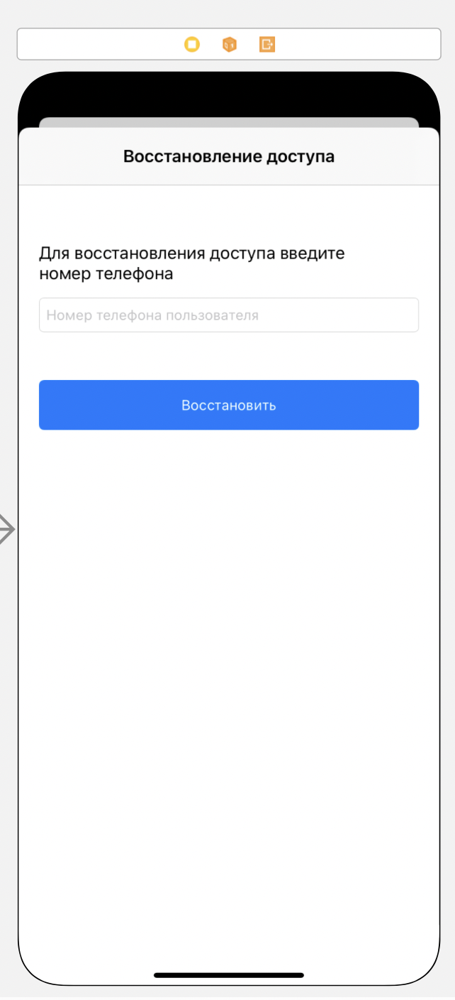

#### Представление для восстановления доступа

> Связи с другими представлениями:
* По нажатию кнопки "Восстановить" при наличии аккаунта переходит 
на [страницу администратора](main.md) при отсутствии аккаунта - модальное окно с информаци о том, что аккаунт не существует

> Задачи на этом представление:
* Ретроспективный дизайн представления
* Создание API сервиса для восстановления на основе Django Rest Framework

> Внешний вид:  

