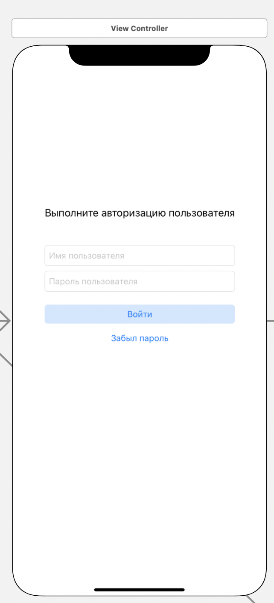

#### Представление авторизации пользователя в системе

> Связи с другими представлениями:
* По нажатию кнопки Войти пользователь при успешной авторизации
переходит на представление [Чаты](../views/chats/main.md)
* Успешная авторизация - ответ сервиса API с соответствующими заголовками
* Ошибка авторизации - ответ сервиса API с соответствующими заголовками, 
в этом случае пользователю выходит информация об ошибке в модальном окне 
* При нажатии кнопки забыл пароль переходим на [представление восстановления доступа](login_reset.md)
* 
> Задачи на этом представление:
* Ретроспективный дизайн представления
* Создание сервиса API доступа на Django Rest Framework

> Внешний вид:  

