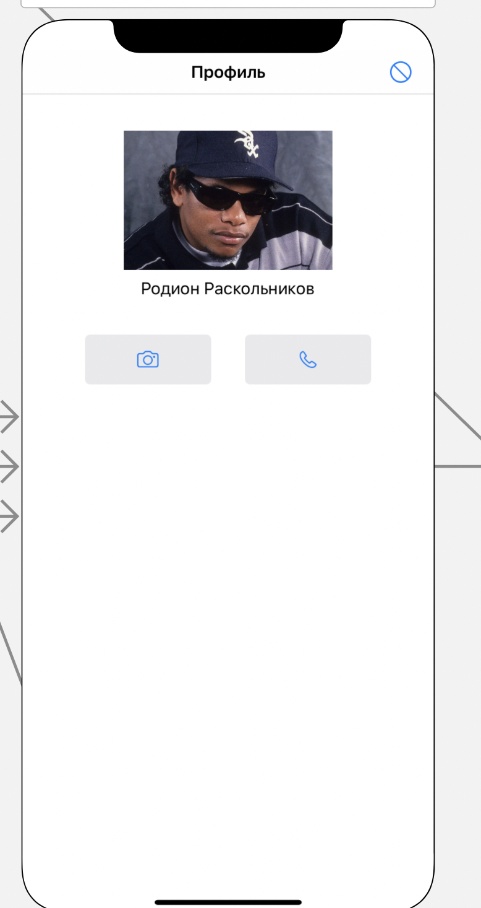

#### Страница с информацией о пользователе 

> Связи с другими представлениями:
* По нажатию кнопки с иконкой трубки телефона
переходит на представление [Аудиозвонок](../views/calls/audio.md) и 
переходит в комнату с аудиозвонком для пользователя по id профиля 
* По нажатию кнопки с иконкой фотокамеры
переходит на представление [Видеозвонок](../views/calls/video.md) и 
переходит в комнату с видеочатом для пользователя по id профиля 
* Для пользователя, которому предложена комната аудиозвонка приход уведомление на экран устройства
* По нажатию кнопки бана в верхнем правом углу - пользователь удаляет текущую сессию приложения

> Задачи на этом представление:
* Ретроспективный дизайн представления
* Создание комнаты на удаленном сервере для выполнения аудиозвонка
* Создание комнаты на удаленном сервере для выполнения видеозвонка
* Создание сервиса API для просмотра информации о пользователе на Django Rest Framework

> Внешний вид:  

> Технологии
* Vue + web pack - точно, с адаптивным дизайном
* Если времени будет много у меня - Flutter для мобильных платформ
